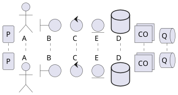

## 1. Introduction

이 문서에서는 `Posts`, `Projects` 페이지에 글을 작성하는 방법 및 간단한 예시를 소개한다.

## 2. File location

이 프로젝트의 article 관리는 파일 기반으로, 다음과 같이 파일을 검색한다. 지원하는 확장자는 `.mdx` 이다.

```text
root/
|
|- posts/
|  |- post1.mdx
|  |
|  |- categoryA/
|  |  |- post2.mdx
|
|- projects/
|  |- project1.mdx
```

`posts` 폴더에 파일을 생성하면 `Posts` 페이지에, `projects` 폴더에 파일을 생성하면 `Projects` 페이지에 해당 article이 추가된다. `posts` 폴더의 경우 하위 폴더를 생성할 수 있도록 되어있다.

## 3. Frontmatter

프로젝트의 파일 시스템은 해당 파일의 경로만 검색한다. 글의 제목을 포함한 세부 정보는 `*.mdx` 파일의 `Frontmatter`로부터 읽어온다. `Post`와 `Project`의 frontmatter 설정은 다음 항목을 참조한다.

### 3.1. Posts

Post의 `Frontmatter`는 다음과 같이 구성된다.

```yml title="*.mdx" showLineNumbers
---
title: Writing Articles (Post, Project)
category: Article
description: This document describes how to write articles
date: 2024-10-24T15:05:00+09:00
tags: ["Markdown", "KaTeX", "PlantUML"]
---
```

> [!NOTE]
> `date` 속성은 sitemap의 `lastModified`에 반영됩니다.

### 3.2. Projects

Project의 `Frontmatter`는 다음과 같이 구성된다.

```yml title="*.mdx" showLineNumbers
---
title: My Project 1
company: Company 1
dateFrom: 2020-01-01
dateTo: 2021-03-01
description: Lorem ipsum dolor sit amet, consectetur adipiscing elit, sed do eiusmod tempor incididunt ut labore et dolore
thumbnail: "/projects/jeje5.jpg"
alt: "Jeje"
published: 2024-10-14
---
```

> [!NOTE]
> 1. `thumbnail`, `alt` 속성은 선택사항입니다.
> 2. `published` 속성은 sitemap의 `lastModified`에 반영됩니다.

> [!IMPORTANT]
> 1. `company` 항목은 `Projects` 페이지에서 카드의 위치를 소속별로 구분할 때도 사용됩니다.
>     - 항목과 일치하는 소속이 없는 경우, `ETC` 섹션에 분리됩니다.
>     - 소속 설정에 대한 내용은 [Project Setup](/posts/tutorial/project-setup#27-experienceinformation)을 참조한다.

## 4. Writing

- 글의 본문을 작성하는 방법은 `Post`, `Project` 모두 기본적으로 [GitHub Flavored Markdown](https://docs.github.com/ko/get-started/writing-on-github/getting-started-with-writing-and-formatting-on-github/basic-writing-and-formatting-syntax)을 사용한다.

    ```md title="*.mdx" showLineNumbers
    ## title

    description

    - Lorem ipsum dolor sit amet
        sed do eiusmod tempor incididunt

    ...
    ```

    > [!TIP]
    > 이 프로젝트에서는 `<h2>{:html}`, `<h3>{:html}`를 파싱하여 `toc`를 자동 생성합니다.

- 글 작성 시 이미지를 불러오는 경우에는 조금 다른데, `root/public/`이 기본 경로로 설정되어 있다.

    ```md
    
    ```

    위와 같이 이미지를 불러오는 경우, 실제로 참조하는 경로는 `root/public/jeje.jpg`가 된다.

- `Code`의 경우 [rehype-pretty-code](https://rehype-pretty.pages.dev/)를 사용하여 `title`, `line number` 등이 지원된다.
- Markdown 외 추가로 `KaTeX`, `PlantUML`이 지원된다. 해당 내용은 아래 섹션을 참조한다.

### 4.1. KaTeX

이 프로젝트는 수식 표현을 위해 [KaTeX](https://katex.org/)를 사용한다. 본문 작성 중 `$` 또는 `$$`를 이용해 작성한다.

```latex title="KaTeX" showLineNumbers
$$
\begin{equation}
  \begin{split}
    F(x)=a+b\\
    =c+b
  \end{split}
\end{equation}
$$
```

$$
\begin{equation}
  \begin{split}
    F(x)=a+b\\
    =c+b
  \end{split}
\end{equation}
$$

### 4.2. PlantUML

이 프로젝트는 다이어그램 작성을 위해 [PlantUML](https://plantuml.com/)을 사용한다. `Fenced Code block`의 언어 설정을 `plantuml`로 해준 뒤 작성한다.

````text title="PlantUML" showLineNumbers

````

